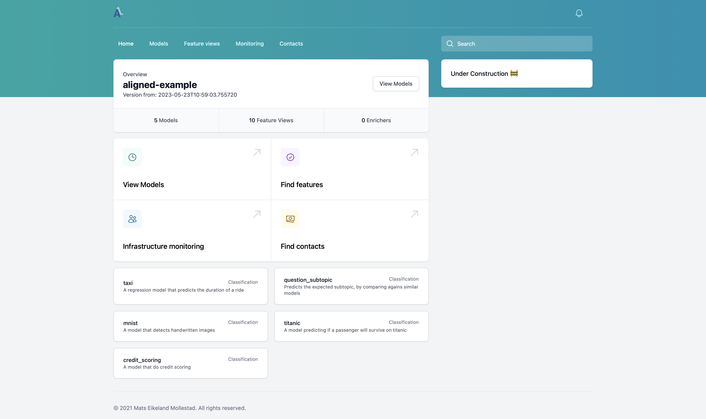

# Aligned Example Minimal

This repo shows how Aligned can be started with almost no code.

The repo will spin up the same architecture and features as the [Alinged Examples repo](https://github.com/MatsMoll/aligned-example).
This is done by referencing the compiled feature definitions from the examples repo. 
But we define the architecutre we want to spin up here.

To start the whole architecture, run:
`docker compose up`

## UI

The UI can be accessed through [UI Link](http://localhost:8002)

